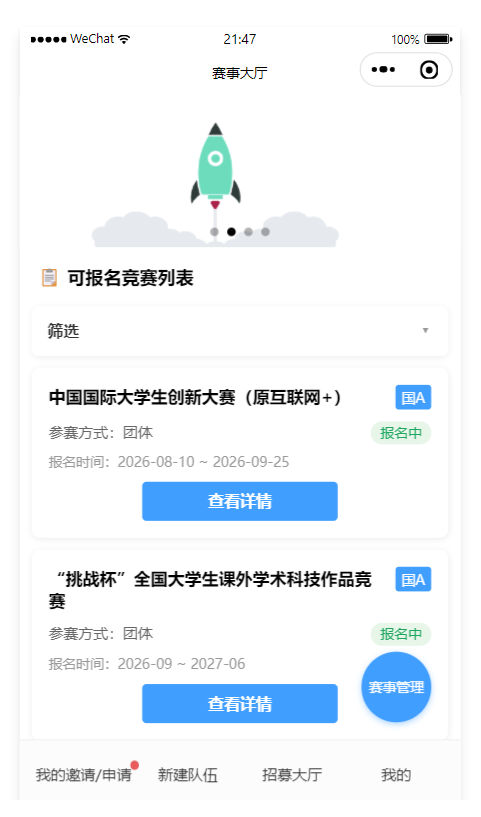
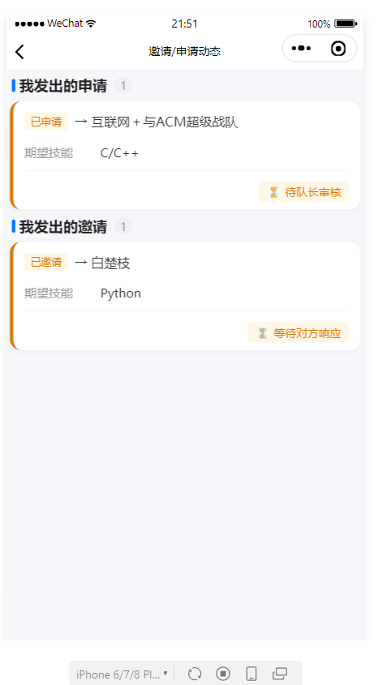
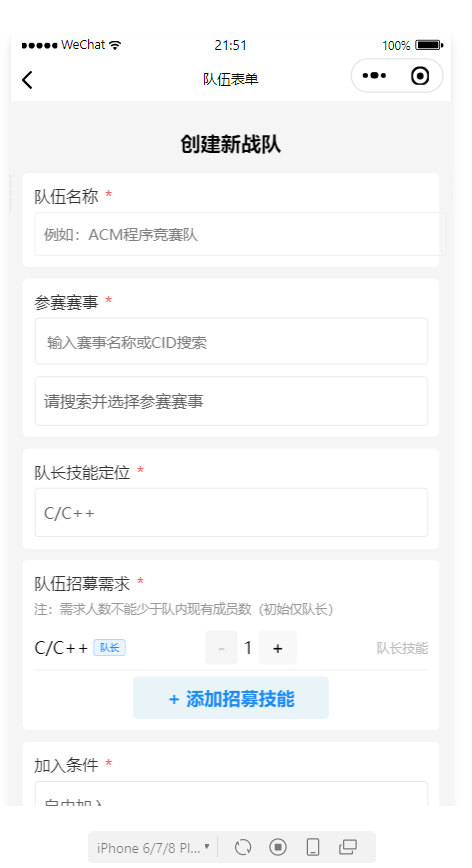
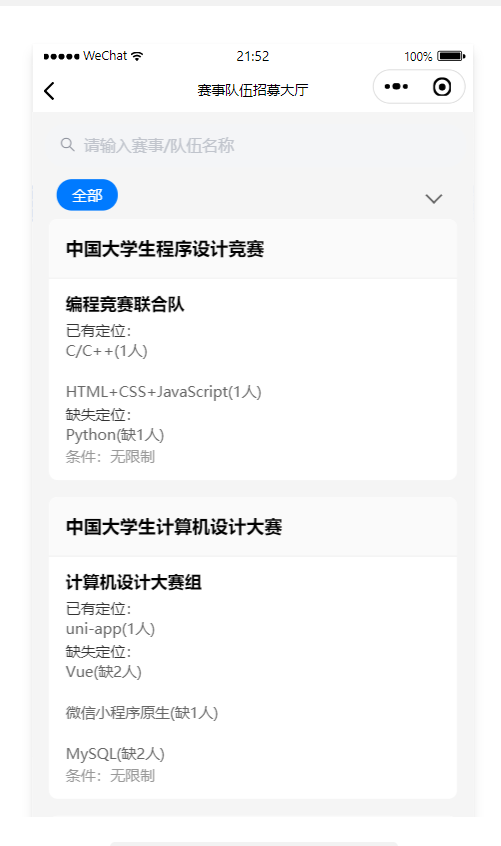
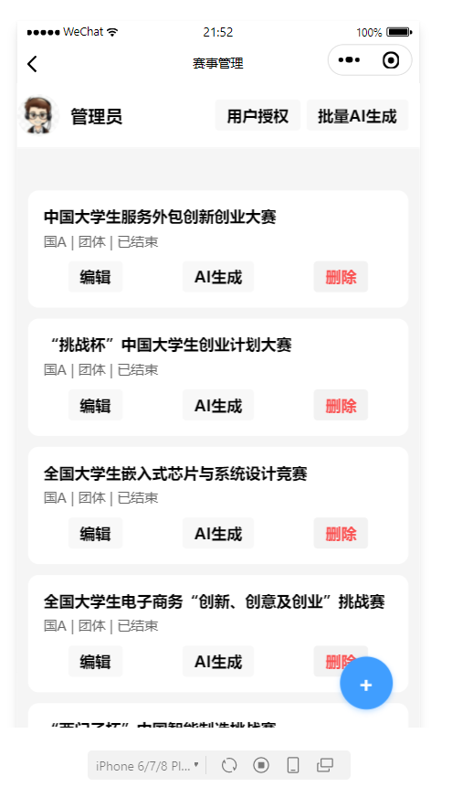
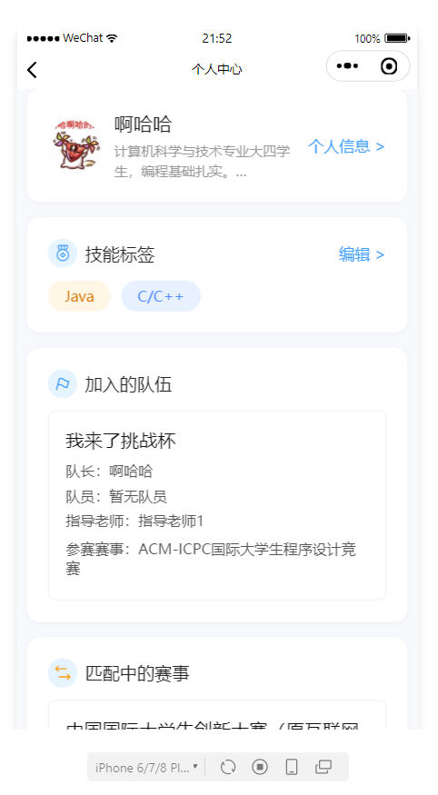
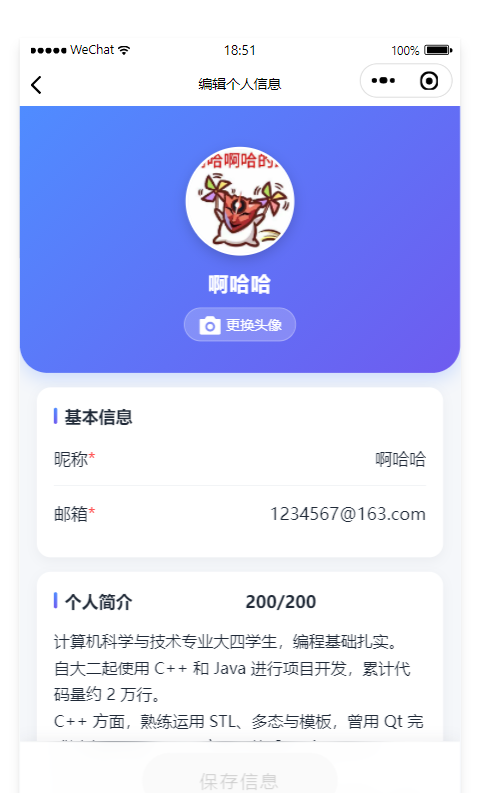
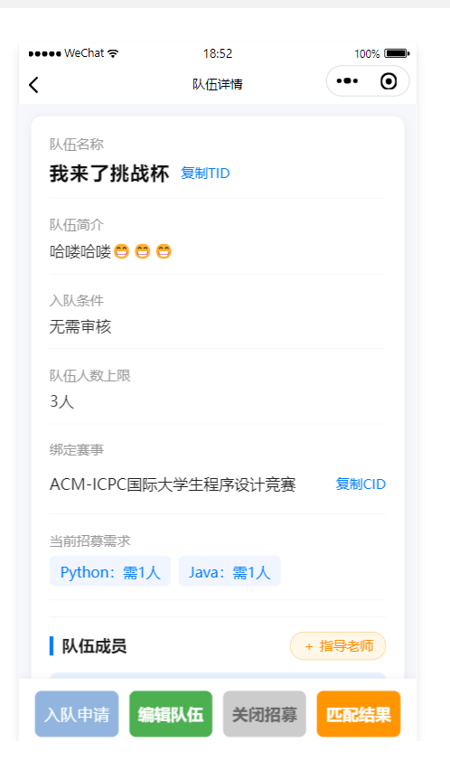
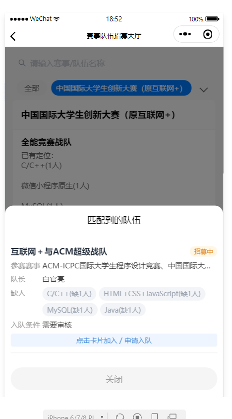
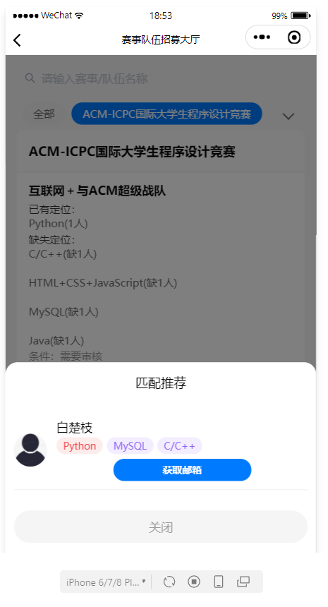

# Smart Team Build (智队搭)

> An intelligent team-building and skill-matching platform for university sci-tech competitions, built on WeChat Mini Program Cloud Development.
> Designed for the iCAN International Collegiate Innovation Competition scenario — helping students go from "finding a competition" to "finding teammates" to "managing the team" and "attaching an advisor" in one place.

---

## 1. Project Introduction

College students face three major pain points when joining sci-tech competitions:

- **Scattered competition info**: entries and announcements are fragmented, hard to browse in one place;
- **Recruiting relies on acquaintances**: no skill-based, scientific way to match teammates;
- **High team-management cost**: members, competitions, skill requirements, and advisors lack unified tooling.

This project delivers a complete solution as a WeChat Mini Program: a competition hall with **AI-generated competition details**, a skill profile with **AI-based skill rating**, full team lifecycle management, an intelligent matching pool, join/invite approval flows, **advisor attachment**, and **solo participation mode**, plus an admin console (competition management, admin authorization).

## 2. Core Features

### 2.1 Competition Module
- **Competition Hall**: list of competitions, pull-to-refresh, filter teams by competition;
- **AI-Generated Details**: admins enter a competition name/link and the Xunfei MaaS LLM automatically writes an intro and value analysis (admin-only, to prevent model abuse);
- Poster/detail image upload; **Word import is a reserved capability** (`wordToHtml` is a stub, not implemented).

### 2.2 User & Skill Profile
- **Silent WeChat Login**: `wxLogin` auto-creates an account; first-time users are guided to bind a student/faculty ID;
- **Personal Profile**: avatar upload (cloud storage), nickname/email/bio editing (email is the contact channel for teammates);
- **Skill Management**: multiple selection from a skill dictionary, rated from 1 to 5 stars;
- **AI Skill Rating**: the LLM rates each skill based on the bio's skill description and persists the result; the UI shows star level and color (1 light silver-grey → 2 blue → 3 purple → 4 gold → 5 red).

### 2.3 Team Module
- **Create / Edit / Delete Teams**: bind multiple competitions (max 5 ongoing competitions per team), set the size cap;
- **Join Condition**: `0` open / `1` requires approval / `2` invite-only;
- **Recruitment Needs**: the leader publishes needed skills and the system computes `team_missing` automatically;
- **Advisor**: search a teacher by uid → send a `subType=advisor` invite → the teacher manually accepts and is attached to `teams.advisor` (does not occupy a member slot, not counted in matching or competition count);
- **Solo Participation Mode**: `isPersonal` single-person teams (forced `maxNum=1`, invite-only, excluded from the matching pool), reusing the full team capability.

### 2.4 Request & Invitation Center
- Users **apply to join**; leaders **invite members/advisors**;
- Pending requests are queryable from the *user / team / captain* perspectives;
- `accept` / `reject` handling automatically syncs members, `tid_list`, the matching pool, and competition status;
- Idempotency: identical pending requests are never created twice.

### 2.5 Intelligent Matching
- Users/teams can enter the **matching pool**; the server filters complementary recommendations via a **dual intersection of skill requirements and competitions**; pool entries are de-duplicated at the **application layer** by `type + targetId` (check-then-write; no composite unique index yet);
- Leaving the pool invalidates stale pending applications to prevent ghost requests.

### 2.6 Admin Console
- **Competition Management**: CRUD, AI-generated details (Word import reserved, not implemented);
- **Admin Authorization**: grant/revoke `isAdmin`, search users by uid/username.
- All sensitive operations are **re-verified server-side** via `isAdmin` (prevents bypassing the frontend).
  **Coverage is limited — see section 9**: competition writes, admin authorization, and skill-dictionary writes are covered; `requestApi`, `matching_poolApi`, and the read actions of `teamsApi` have no caller identity check.

### 2.7 Personal Center
- Joined team list, advisor relationships, contact retrieval (same-team verified; phone numbers are never exposed, email only).

## 3. Technical Architecture

| Layer | Technology | Notes |
| --- | --- | --- |
| Frontend | WeChat Native Mini Program + Vant Weapp | Glass-easel component framework, sub-package loading |
| State | Custom store (`store/`) | Per-module subscribe/publish; async methods auto-refresh views |
| Backend | WeChat Cloud Development (Serverless) | 8 cloud functions, 63 actions (userApi 19 / teamsApi 18 / competitionApi 9 / requestApi 5 / adminAuth 4 / skillApi 4 / matching_poolApi 4) |
| Data | Cloud Database + Cloud Storage | 6 collections, numeric-ID relationships (uid/tid/cid/sid) |
| AI | Xunfei MaaS LLM (`xopdeepseekv32`) | Competition details & skill rating (non-streaming, 25s timeout) |
| Cloud Env | `cloud1-d8gb9nir3847ec081` | Declared in `app.js` / `project.config.json` |

Main dependencies: `@vant/weapp` (UI), `axios` (AI calls inside cloud functions). (`mammoth` is installed but Word parsing is not implemented — see section 9.)

## 4. Project Structure

```
├── app.js / app.json / app.wxss      # Mini program entry (silent login, cloud init)
├── cloudfunctions/                   # Cloud functions (see section 5)
├── pages/
│   ├── index/                        # Competition Hall (home page)
│   └── logs/
├── subPackages/                      # Business sub-packages
│   ├── admin/                        # admin Competition Management / admin_users Admin Authorization
│   ├── competition/                  # competition_info Competition Detail
│   ├── joined/                       # joined My Participations
│   ├── team/                         # team_list Recruiting Hall / team_info Team Detail / team_push Team Form
│   ├── user/                         # user Personal Center / profile Edit Profile / profile_register Binding / user_push User Form
│   └── images/                       # Local static images
├── store/                            # Global state: user / teams / competition / skills / matching_pool
├── miniprogram_npm/                  # npm packages (@vant/weapp, etc.)
├── utils/                            # Utility functions
└── project.config.json               # Project config (appid, cloud env)
```

## 5. Cloud Functions

| Cloud Function | Responsibility | Main actions |
| --- | --- | --- |
| `userApi` | Login / profile / skills / rating / admin authorization | `wxLogin` `updateProfile` `setSkillList` `aiRateSkills` `setSkillRatingMap` `getTeachers` `getContact` `searchUsers` `setAdmin` `getByUid`, etc. |
| `teamsApi` | Full team lifecycle | `create` `getList` `getByTid/Uid/Cid` `addMember` `removeMember` `addAdvisor` `removeAdvisor` `setTeamNeeds` `setCondition` `setMatchStatus` `update` `delete`, etc. |
| `requestApi` | Apply / invite / handle | `create` (supports `subType=advisor`) `getByUser` `getByTeam` `getByCaptain` `handle` |
| `matching_poolApi` | Matching pool | `enterPool` `exitPool` `getMatchList` `getMyPool` |
| `competitionApi` | Competition management + AI generation | `getAll` `create` `update` `delete` `aiGenDetail` `getFileTempUrl` (writes require admin); `wordToHtml` is a reserved stub, not implemented |
| `getFileUrl` | Convert fileIDs to temp links | — |
| `skillApi` | Skill dictionary | `getAll` `add` `update` `delete` (writes require admin; `delete` runs a 4-place reference check and refuses instead of cascading) |

Unified response: `{ code, msg, data }` (`0` success / `-99` unknown action / `-403` forbidden / `-500` server error).

## 6. Data Collections

Create the following **6 collections** in the Cloud Development Console:

| Collection | Purpose | Key fields |
| --- | --- | --- |
| `user` | User profiles | `_openid` `userInfo.uid/username/avatar/email/introduction/institute` `role` `skills` `skill_rating` `tid_list` `onGoing_cid` `is_matching` `isAdmin` |
| `teams` | Teams | `tid` `name` `cid_list` `leader` `members` `advisor` `condition` `maxNum` `team_needs` `team_missing` `isPersonal` `is_matching` |
| `skills` | Skill dictionary | `sid` `name` `desc` |
| `requests` | Applications / invitations | `type` `subType` (advisor) `tid` `uid` `cid` `skillId` `status` `createTime` |
| `matching_pool` | Matching pool | `type` `targetId` `match_items` `createTime` |
| `competition` | Competitions | `cid` `name` `url` `level` `poster` `detailPoster` `detailImageList` `content` `status` `start` `end` |

> Permissions: for production, configure custom security rules per business need; for development, "all users readable, only creator readable/writable" is enough — critical writes go through cloud functions with admin privileges anyway.

## 7. Quick Start

1. **Environment**: install [WeChat Developer Tools](https://developers.weixin.qq.com/miniprogram/dev/devtools/download.html).
2. **Import**: import the project with its AppID (`wxf60da1805ba7ff3e` in `project.config.json`) and enable Cloud Development.
3. **Cloud env**: create an environment, then update `env` in `wx.cloud.init` inside `app.js` and `cloudEnvId` in `project.config.json` to your own.
4. **Deploy functions**: right-click each of the 8 functions under `cloudfunctions` → "Upload and Deploy: Cloud Install Dependencies".
5. **Create collections**: create the 6 collections from section 6 and seed the `skills` dictionary.
6. **Configure AI env vars**: see the next section.
7. **Init admin**: set `isAdmin: true` on an admin user document (or call `userApi.setAdmin`).

## 8. AI Configuration

Cloud functions read the Xunfei MaaS credentials from **environment variables** — no secrets are hard-coded:

- Cloud Console → Cloud Functions → select `competitionApi` and `userApi` → Configuration → Environment Variables:
  - `AI_API_KEY`: the `APIKey:APISecret` credential from the Xunfei console (colon-separated, no quotes);
  - `AI_MODEL_ID`: the model ID (e.g. `xopdeepseekv32`);
- **Re-deploy the cloud functions after configuration** — env vars are injected at deploy time;
- AI requests return 401 if `AI_API_KEY` is missing; `AI_MODEL_ID` falls back to `xopdeepseekv32` if absent.

## 9. Notes & Known Limitations

- **Login state**: `wxLogin` / `updateProfile` / `getContact` depend on the WeChat `OPENID`; testing directly from the cloud console is ineffective — verify from the Mini Program.
- **Real DB writes**: cloud function writes change the database immediately; use sample data and clean up after tests.
- **Slow AI**: non-streaming LLM calls take ~10–25s; mind cloud function timeouts and frontend feedback.
- **Authorization (limited coverage)**: competition writes, admin authorization, and skill-dictionary writes are re-verified server-side (`isAdmin`); direct console calls return `-403` as expected. **Boundary**: all actions of `requestApi` and `matching_poolApi`, plus the read actions of `teamsApi` (`getList` / `getByTid` / `getByUid` / `getByCid`), have no caller identity check — do not claim "every endpoint is authorized" in external docs.
- **Known stubs**: `userApi.setMatch` and `userApi.deleteUser` are routed but not implemented in the service layer (return `-500`, do not affect current features); `competitionApi.wordToHtml` is a reserved stub that does not parse Word (`mammoth` is installed but not wired up).
- **No server-side AI cache**: `aiGenDetail` results are not cached server-side — every call hits the LLM. The frontend only filters "competitions that already have content"; do not describe this as "AI result caching".
- **Matching-pool uniqueness**: entries are de-duplicated at the application layer by `type + targetId` (check-then-write); there is **no composite unique index** in the database, so duplicates are still possible under concurrency.
- **Secrets**: credentials live in the cloud console as env vars; never commit a plaintext `AI_API_KEY`.

### 9.1 DevTools Pitfall: Missing `@swc/runtime` Helpers (hit three times)

**Symptom**: blank page, console reports

```
module '@swc/runtime/_array_with_holes.js' is not defined, require args is './_array_with_holes.js'
```

The helper name may change (`_array_without_holes.js`, `_object_spread.js`, `_non_iterable_spread.js`) — the root cause is the same.

**Cause**: the DevTools "ES6 → ES5" downleveling is done by SWC, which emits `require('./_xxx.js')` in its output, but some tool versions (e.g. `2.02.2608060`) **do not generate those helper files**, so the page crashes on load. This is **not a bug in business code** — the whole helper-injection chain is missing.

**Two independent triggers found on 2026-09-20** (downgrading the base library from `3.16.1` to `2.33.0` did **not** help):

1. A rest parameter in `store/index.js` (`async function (...args)`) — SWC downlevels it to
   `var args = new Array(arguments.length)`, which creates array holes and pulls in `_array_with_holes`.
   Fixed by using explicit parameters: `function (name, desc)`.
2. Vant's build output under `miniprogram_npm/@vant/weapp` contains equivalent patterns
   (e.g. `Array(n)` and `__spreadArray([], …)` in `datetime-picker/index.js`). With `enhance` or `minified`
   enabled, the built npm package can reference the missing helper.

**Final fix**: remove the rest parameter **+** disable `enhance`/`minified` **+** delete `miniprogram_npm` and run "Build npm" again.

**Troubleshooting order (cheapest first)**:

1. **Clear cache & restart**: Tools → Clear Cache → All → close and reopen the project.
2. **Disable ES5 downleveling**: `project.config.json` → `setting.es6: false`. lib 2.33 supports ES6+ natively.
3. **Switch DevTools version**: if both fail, the compiler itself is buggy — use the latest stable build or roll back one.

> Switching the base library version is **ineffective** for this issue (`3.16.1` and `2.33.0` behave identically).

### 9.2 Cloud Function Pitfall: `cloud.init()` Must Run Before `require('./service')`

**Symptom**: calling the function returns

```
Error: errCode: -504002 functions execute fail | errMsg: 145 code exit unexpected
```

The function log contains **no business-code frames at all** — only the platform runtime (`/data/scf/frame/node16/runtime.js`) — with `InitFunction: 0ms / Duration: 0ms / MemUsage: 0.00MB`, meaning not a single line of user code ran.

**Cause**: `skillApi/index.js` originally required the service before initializing the SDK:

```js
const cloud = require('wx-server-sdk')
const skillService = require('./service')   // ← not initialized yet
cloud.init({ env: cloud.DYNAMIC_CURRENT_ENV })
```

`service.js` exports `new SkillService()` at the top level, and the constructor immediately calls `cloud.database()`. Accessing the database before `init` throws, so the **module load itself fails** and the process exits during init.

**Fix** (same convention as `teamsApi` in this project):

1. In `index.js`: call `cloud.init()` **before** `require('./service')`;
2. In `service.js`: call `cloud.init({ env: cloud.DYNAMIC_CURRENT_ENV })` **itself**, so it no longer depends on require order.

**A different symptom that looks similar**:

```
TypeError: Cannot read properties of undefined (reading 'toString')
    at writeRuntimeFile (/data/scf/frame/node16/runtime.js:65:37)
```

That means the **deployed package itself is broken** (empty package / missing `index.js`), not an init-order problem. Delete the function in the Cloud Console → re-run "Upload and Deploy: Cloud Install Dependencies". The package should contain `index.js`, `service.js`, `package.json`, `config.json`.

> After deploying, run a **cloud test** first (`{"action":"getAll"}`) and confirm it returns `{"code":0,...}` before triggering from the Mini Program — this avoids mistaking "deployment failed" for "code bug".

## 10. Version History

| Version | Date | Milestone |
| --- | --- | --- |
| v0.1 | 2026-08-26 | Base framework + 8 cloud functions + 6 collections; apply/invite/matching pipeline connected |
| v0.2 | 2026-08-28 | Permission hardening (`ensureAdmin`), AI output normalization, matching-pool sync fixes |
| v0.3 | 2026-08-29 | Advisor module, solo participation mode, competition status check, uid uniqueness check |
| v0.4 | 2026-08-30 | Recruiting-hall filtering, team-list blank fix, iOS compatibility, profile page UX improvements |
| v0.5 | 2026-09-20 | Consolidated `skillApi` (admin checks + delete reference check), fixed cloud-function load crash (`cloud.init()` order), fixed SWC helper crash, migrated `store/skills.js` to skillApi (zero changes at call sites) |

## 11. UI Screenshots

Screenshots below map one-to-one to the feature modules described above:

### 11.1 Competition Hall (Home)



### 11.2 Invitations / Applications Feed



### 11.3 Create a Team



### 11.4 Team Recruiting Hall



### 11.5 Competition Management (Admin Console)



### 11.6 Personal Center



### 11.7 Edit Profile



### 11.8 Team Detail



### 11.9 Intelligent Matching: User Matches a Team



### 11.10 Intelligent Matching: Team Finds Teammates


